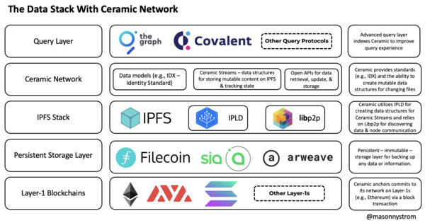

# Decentralized Identity

Decentralized Identity is a digital identification concept where people, companies, and items are in charge of their data and can share it selectively without relying on a centralized authority.

## Ceramic - The Composable Data Network

- Ceramic is a public, permissionless, open-source protocol that offers computation, state transitions, and consensus for all data structures on the decentralized web.
- Ceramic architecture 

## Commands

- npx create-next-app@latest .
- npm install @self.id/web @self.id/react
- npm run dev
- npm install -D tailwindcss postcss autoprefixer
- npx tailwindcss init -p
